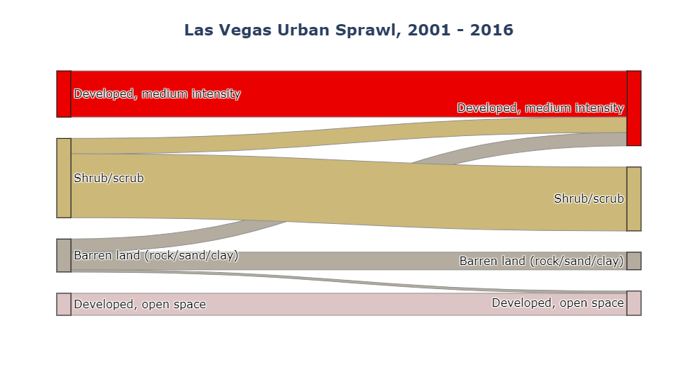
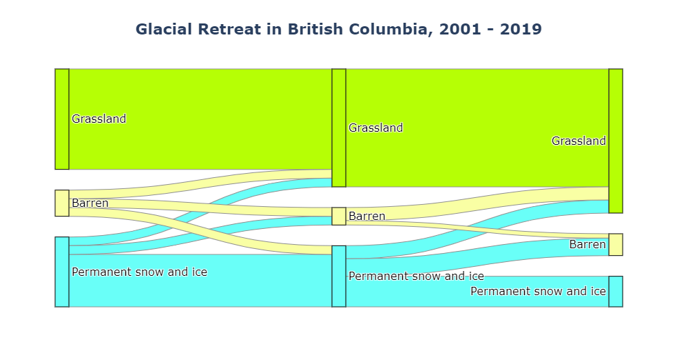

# sankee

[](https://mybinder.org/v2/gh/aazuspan/sankee/HEAD?filepath=docs%2Fexamples%2Fmodis_snow_and_ice.ipynb)
[](https://anaconda.org/conda-forge/sankee)
[](https://pypi.org/project/sankee)
[](https://sankee.readthedocs.io/en/latest/?badge=latest)
[](https://opensource.org/licenses/GPL-3.0)
[](https://pepy.tech/project/sankee)

Visualize changes in classified time series data with interactive Sankey plots in Google Earth Engine


## Contents

- [Description](https://github.com/aazuspan/sankee#Description)
- [Installation](https://github.com/aazuspan/sankee#Installation)
  - [Using Pip](https://github.com/aazuspan/sankee#Using-Pip)
  - [Using Conda](https://github.com/aazuspan/sankee#Using-Conda)
- [Requirements](https://github.com/aazuspan/sankee#Requirements)
- [Quick Start](https://github.com/aazuspan/sankee#Quick-Start)
  - [Using a Premade Dataset](https://github.com/aazuspan/sankee#Using-a-Premade-Dataset)
  - [Using a Custom Dataset](https://github.com/aazuspan/sankee#Using-a-Custom-Dataset)
- [Features](https://github.com/aazuspan/sankee#Features)
  - [Modular Datasets](https://github.com/aazuspan/sankee#Modular-Datasets)
  - [Flexible Time Series](https://github.com/aazuspan/sankee#Flexible-Time-Series)
  - [Integration with geemap](https://github.com/aazuspan/sankee#Integration-with-geemap)
  - [Editable Plots](https://github.com/aazuspan/sankee#Editable-Plots)
- [Contributing](https://github.com/aazuspan/sankee#Contributing)

## Description

`sankee` provides a dead-simple API that combines the power of [Google Earth Engine](https://github.com/google/earthengine-api) and [Plotly](https://github.com/plotly/plotly.py) to visualize changes in land cover, plant health, burn severity, or any other classified imagery over a time series in a region of interst using interactive Sankey plots. Use a library of built-in datasets like NLCD, MODIS Land Cover, or CGLS for convenience or define your own custom datasets for flexibility. `sankee` works by randomly sampling points in a time series of classified imagery to visualize how cover types changed over time.

`sankee` can be found in the [Earth Engine Developer Resources](https://developers.google.com/earth-engine/tutorials/community/developer-resources#python)!

## Installation

### Using Pip

```bash
pip install sankee
```

### Using Conda

`sankee` can be downloaded through conda-forge within a Conda environment.

```bash
conda install -c conda-forge sankee
```

## Requirements

- An authenticated GEE Python environment ([offical guide](https://developers.google.com/earth-engine/guides/python_install))

## Quick Start

### Using a Premade Dataset

Datasets in `sankee` are used to apply labels and colors to classified imagery (e.g. a value of 42 in an NLCD 2016 image should be labeled "Evergeen forest" and colored green). `sankee` includes premade `Dataset` objects for common classified datasets in GEE like the National Land Cover Dataset (NLCD), MODIS land cover, Copernicus Global Land Service (CGLS), and the Landscape Change Monitoring System (LCMS).

```python
import ee
import sankee

ee.Initialize()

# Choose a premade dataset object that contains band, label, and palette information for NLCD
dataset = sankee.datasets.NLCD2016

# Select images to compare
nlcd2001 = ee.Image("USGS/NLCD/NLCD2001")
nlcd2016 = ee.Image("USGS/NLCD/NLCD2016")

# Build a list of images
img_list = [nlcd2001, nlcd2016]
# Build a matching list of labels for the images (optional)
label_list = ["2001", "2016"]

# Define an area of interest
vegas = ee.Geometry.Polygon(
    [[[-115.01184401606046, 36.24170785506492],
      [-114.98849806879484, 36.29928186470082],
      [-115.25628981684171, 36.35238941394592],
      [-115.34692702387296, 36.310348922031565],
      [-115.37988600824796, 36.160811202271944],
      [-115.30298171137296, 36.03653336474891],
      [-115.25628981684171, 36.05207884201088],
      [-115.26590285395109, 36.226199908103695],
      [-115.19174513910734, 36.25499793268206]]])

# Choose a title to display over your plot (optional)
title = "Las Vegas Urban Sprawl, 2001 - 2016"

# Generate your Sankey plot
plot = sankee.sankify(img_list, vegas, label_list, dataset, max_classes=4, title=title)
plot
```
A more thorough [example](https://sankee.readthedocs.io/en/latest/examples/modis_snow_and_ice.html) using sankee to plot changes in MODIS snow and ice cover can be found in the documentation.


### Using a Custom Dataset

Datasets can also be manually defined for custom images. Custom images could be user-created land cover classifications, burn severity maps, deforestation maps, etc. Anything where pixel values represent specific classifications. See the documentation for [an example](https://sankee.readthedocs.io/en/latest/examples/custom_landsat_ndvi.html) of using sankee with a custom classified NDVI dataset.

## Features

### Modular Datasets

Datasets in `sankee` define how classified image values are labeled and colored when plotting. `label` and `palette` arguments for `sankee` functions can be manually provided as dictionaries where pixel values are keys and labels and colors are values. Every value in the image **must** have a corresponding color and label. Datasets also define the `band` name in the image in which classified values are found.

Any classified image can be visualized by manually defining a band, palette, and label. However, premade datasets are included for convenience in the `sankee.datasets` module. To access a dataset, use its name, such as `sankee.datasets.NLCD2016`. To get a list of all dataset names, run `sankee.datasets.names()`. Datasets can also be accessed using `sankee.datasets.get()` which returns a list of `Dataset` objects that can be selecting by indexing.

```python
# List all sankee built-in datasets
sankee.datasets.names()

>> ['LCMS_LU',
    'LCMS_LC',
    'NLCD2016',
    'MODIS_LC_TYPE1',
    'MODIS_LC_TYPE2',
    'MODIS_LC_TYPE3',
    'CGLS_LC100']

# Preview a list of available images belonging to one dataset
sankee.datasets.CGLS_LC100.get_images(3)

>> ['COPERNICUS/Landcover/100m/Proba-V-C3/Global/2015',
    'COPERNICUS/Landcover/100m/Proba-V-C3/Global/2016',
    'COPERNICUS/Landcover/100m/Proba-V-C3/Global/2017',
    '...']
```

### Flexible Time Series

`sankee` can handle any length of time series. The number of images will determine the number of time steps in the series. The example below shows a three-image time series.



### Integration with geemap

[geemap](https://github.com/giswqs/geemap) is a great tool for exploring changes in GEE imagery before creating plots with `sankee`. Integration is quick and easy. Just use `geemap` like you normally would, and pass the images and feature geometries to `sankee` for plotting. Click [here](https://mybinder.org/v2/gh/aazuspan/sankee/HEAD?filepath=examples%2Fexample_snow_and_ice.ipynb) for an interactive notebook that demonstrates using `sankee` with `geemap`.

The `sankee` package is also integrated directly into `geemap`, giving users a code-free interface to `sankee's` premade datasets (thanks [Qiusheng Wu](https://github.com/giswqs)!). [Documentation](https://geemap.org/notebooks/75_sankee/) and [video tutorials](https://www.youtube.com/watch?v=IZWpJYX6w8I) are available from `geemap`. Support for custom datasets is [coming soon](https://github.com/giswqs/geemap/issues/471) to `geemap`!

### Editable Plots

The plot returned by `sankee.sankify` is a `plotly.graph_objs._figure.Figure` which can be easily edited after creation like any other Plotly [Graph Object](https://plotly.com/python/graph-objects/). The [`plot.update_layout`](https://plotly.com/python/reference/layout/) function has many options which can be used to change things like [plot size](https://plotly.com/python/setting-graph-size/) or [label styles](https://plotly.com/python/figure-labels/). For example, we can update plot size and title color of an existing plot using the code below. 
```python
plot = sankee.sankify( ... )
plot.update_layout(height=1000, width=2400, title_font_color="red")
```

## Contributing

If you find bugs or have feature requests, please open an issue!

---

[Top](https://github.com/aazuspan/sankee#sankee)
