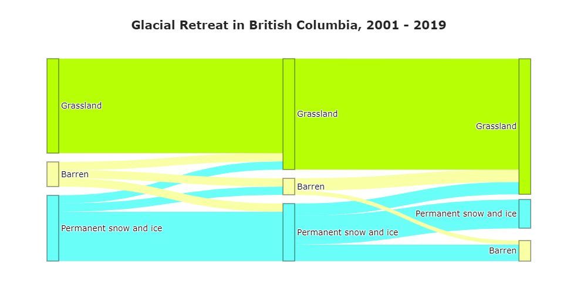
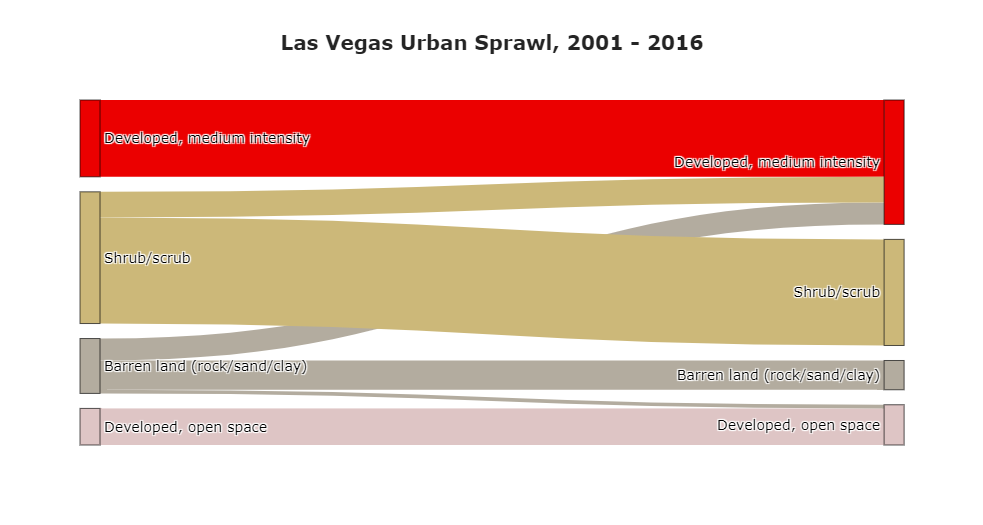
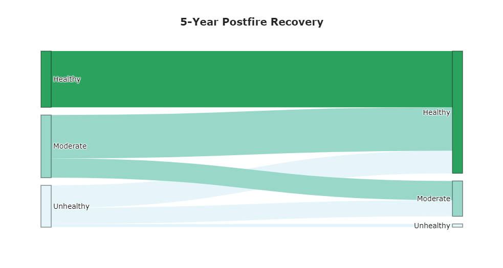

# sankee
Visualize classified time series data with interactive Sankey plots in Google Earth Engine

[](https://htmlpreview.github.io/?https://github.com/aazuspan/sankee/main/examples/MODIS.html)


## Description
`sankee` provides a dead-simple API that combines the power of GEE and Plotly to visualize changes in land cover, plant health, burn severity, or any other classified imagery over a time series in a region of interst using interactive Sankey plots. Use a library of built-in datasets like NLCD or MODIS Land Cover for convenience or define your own custom datasets.

## Installation

In progess...

## Requirements
- An authenticated GEE Python environment ([offical guide](https://developers.google.com/earth-engine/guides/python_install))
- `Numpy`, `Pandas`, `Plotly`, and `earthengine-api`

## Usage 

### Using a Premade Dataset
`sankee` includes premade `Dataset` objects for common classified datasets in GEE. See [datasets](https://github.com/aazuspan/sankee#Datasets) for a detailed explanation.
```python
# Choose a premade dataset object contains band, label, and palette information for NLCD
dataset = sankee.datasets.NLCD2016

# Build a list of images
img_list = [ee.Image(f"USGS/NLCD/NLCD2001"), ee.Image(f"USGS/NLCD/NLCD2016")]
# Build a matching list of labels for the images
label_list = [2001, 2016]

# Define an area of interest
vegas = ee.Geometry.Polygon(
        [[[-115.4127152226893, 36.29589873319828],
          [-115.4127152226893, 36.12082334399102],
          [-115.3248245976893, 36.12082334399102],
          [-115.3248245976893, 36.29589873319828]]])

# Choose a title to display over your plot (optional)
title = "Las Vegas Urban Sprawl, 2001 - 2016"

# Generate your Sankey plot
plot = sankee.sankify(img_list, vegas, label_list, dataset, max_classes=4, title=title)
```
[](https://htmlpreview.github.io/?https://github.com/aazuspan/sankee/main/examples/NLCD.html)

### Using a Custom Dataset
Datasets can also be manually defined for custom datasets. See [datasets](https://github.com/aazuspan/sankee#Datasets) for a detailed explanation.
```python
band = "health"

# Specify the band name for the image
labels = {
    0: "Unhealthy",
    1: "Moderate",
    2: "Healthy"
}
# Assign labels to each pixel value
palette = {
    0: "#e5f5f9",
    1: "#99d8c9",
    2: "#2ca25f"
}

# Select images (in this case, classified NDVI values before and after fire)
img_list = [immediate_class, recovery_class]
label_list = ["Immediate", "Recovery"]

# Generate your Sankey plot
plot = sankee.sankify(img_list, fire, label_list, band=band, labels=labels, palette=palette, scale=20)
```
[](https://htmlpreview.github.io/?https://github.com/aazuspan/sankee/main/examples/NDVI.html)


### Separate Functions for Maximum Control
`sankee.sankify` is a convenience function that wraps four separate functions.
1. `sankee.sample`  
    1. Generates `n` random samples within the region. 
    2. Identify the image class at each time step in each sample.
2. `sankee.clean`
    1. Optionally filter out specific classes identified by `exclude`.
    2. Optionally remove small classes to enforce `max_classes`.
3. `sankee.reformat`
    1. Calculate the relative frequency of each class transition at each time step.
    2. Reshape the data for input into Plotly's Sankey API.
4. `sankee.plot` 
    1. Generate and return an interactive plot.

For maximum control, each of these functions is available independently, allowing you store sampled data, use your own data, do your own data cleaning, etc.

### Datasets

Datasets in `sankee` define how classified image values are labeled and colored when plotting (eg. a value of 42 in an NLCD 2016 image should be labeled "Evergeen forest" and colored green). `label` and `palette` arguments for `sankee` functions can be manually provided as dictionaries where pixel values are keys and labels and colors are values. Every value in the image __must__ have a corresponding color and label. Datasets also define the `band` name in the image in which classified values are found.

Any classified image can be visualized by manually defining a band, palette, and label. However, premade datasets are included for convenience in the `sankee.datasets` module. To access a dataset, use its name, such as `sankee.datasets.NLCD2016`. To get a list of all dataset names, run `sankee.datasets.names()`. Datasets can also be accessed using `sankee.datasets.get()` which returns a list of `Dataset` objects that can be selecting by indexing.

## API
### sankee.sankify(image_list, region, *label_list, dataset, band, labels, palette, exclude, max_classes, n, title, scale, seed, dropna*)

Randomly sample a list of images to generate a Sankey plot for visualizing change in classified pixel values over time.

__Arguments__  
- image_list (list)
  - An ordered list of images representing a time series of classified data. Each image will be sampled to generate the Sankey plot. Any length of list is allowed, but lists with more than 3 or 4 images may produce unusable plots. 
- region (ee.Geometry)
  - A region to generate samples within.
- *label_list (list, default: None)*
  - An list of labels corresponding to the images. The list must be the same length as `image_list`. If none is provided, sequential numeric labels will be automatically assigned starting at 0.
- *dataset (sankee.datasets.Dataset, default: None)*
  - A premade dataset that defines the band, labels, and palette for all images in `image_list`. If none is provided, `band`, `labels`, and `palette` must be provided instead.
- *band (str, default: None)*
  - The name of the band in all images of `image_list` that contains classified data. If none is provided, `dataset` must be provided instead.
- *labels (dict, default: None)*
  - The labels associated with each value of all images in `image_list`. Every value in the images must be included in the `labels` dictionary. If none is provided, `dataset` must be provided instead.
- *palette (dict, default: None)*
  - The colors associated with each value of all images in `image_list`. Every value in the images must be included in the `palette` dictionary. If none is provided, `dataset` must be provided instead. Colors must be supported by `Plotly`.
- *exclude (list, default: None)*
  - An optional list of pixel values to exclude from the plot. Excluded values must be raw pixel values rather than class labels.
- *max_classes (int, default: None)*
  - If a value is provided, small classes will be removed until `max_classes` remain.
- *n (int, defualt: 100)*
  - The number of samples points to randomly generate for characterizing all images. More samples will provide more representative data but will take longer to process.
- *title (str, default: None)*
  - An optional title that will be displayed above the Sankey plot.
- *scale (int, default: None)*
  - The scale in image units to perform sampling at. If none is provided, GEE will attempt to use the image's nominal scale, which may cause errors.
- *seed (int, default: 0)*
  - The seed value used to generate repeatable results during random sampling.
- *dropna (bool, default: True)*
  - If the `region` extends into areas that contain no data in any image, some samples may have null values. If `dropna` is True, those samples will be dropped. This may lead to fewer samples being returned than were requested by `n`. 

__Returns__
- A Plotly Sankey plot object.

---
### sankee.datasets.names()

Get a list of supported dataset names. Names can be used to access datasets using `sankee.datasets.{dataset_name}`.

__Arguments__
- None

__Returns__ (list)
- A list of strings for supported dataset names.
---
### sankee.datasets.get(*i*)
Get a list of supported `sankee.datasets.Dataset` objects.  
__Arguments__
- *i (int, default: None)*
  - An optional index to retrieve a specific dataset.  

__Returns__ (list)
- A list of supported `sankee.datasets.Dataset` objects. If `i` is provided, only one object is returned.
