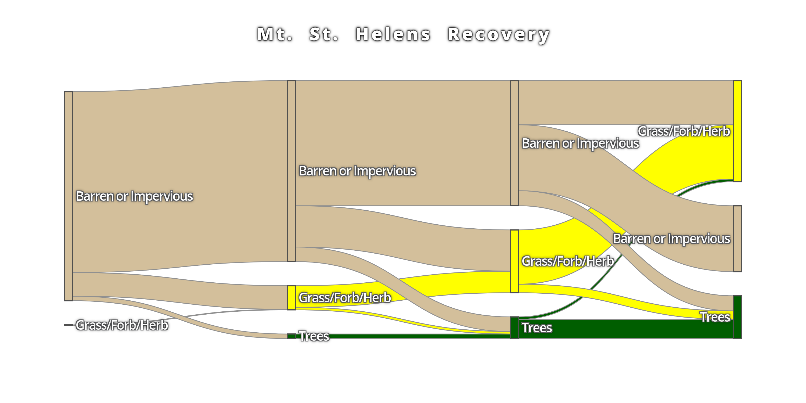
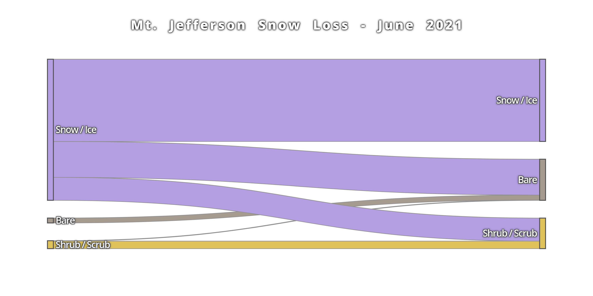

# sankee

[](https://developers.google.com/earth-engine/tutorials/community/intro-to-python-api)
[](https://mybinder.org/v2/gh/aazuspan/sankee/HEAD?filepath=docs%2Fexamples%2Fmodis_snow_and_ice.ipynb)
[](https://anaconda.org/conda-forge/sankee)
[](https://pypi.org/project/sankee)
[](https://github.com/aazuspan/sankee/actions/workflows/ci.yml)
[](https://codecov.io/gh/aazuspan/sankee)
[](https://sankee.readthedocs.io/en/latest/?badge=latest)
[](https://pepy.tech/project/sankee)

Visualize changes in classified time series data with interactive Sankey plots in Google Earth Engine


## Description

Use [Earth Engine](https://github.com/google/earthengine-api) to visualize changes in land cover, plant health, burn severity, or any other time series of classified imagery with interactive Sankey plots. Use a library of [built-in datasets](https://sankee.readthedocs.io/en/latest/sankee.html#premade-datasets) for convenience or define your own [custom datasets](https://sankee.readthedocs.io/en/latest/sankee.html#custom-datasets) for flexibility.


## Installation

### Pip

```bash
pip install sankee
```

### Conda

```bash
conda install -c conda-forge sankee
```

## Quickstart

### Premade Datasets

Visualize annual changes in land cover using [popular LULC datasets](https://sankee.readthedocs.io/en/latest/sankee.html#supported-datasets) with a couple lines of code. Just choose a dataset, an area of interest, and a list of years to generate a Sankey diagram from a premade dataset. Below, we can look at 30 years of vegetation recovery in the area devastated by the Mt. St. Helens eruption.

```python
import sankee
import ee

ee.Initialize()

sankee.datasets.LCMS_LC.sankify(
  years=[1990, 2000, 2010, 2020],
  region=ee.Geometry.Point([-122.192688, 46.25917]).buffer(2000),
  max_classes=3,
  title="Mt. St. Helens Recovery"
)
```



Check out the [example notebook](https://sankee.readthedocs.io/en/latest/examples/modis_snow_and_ice.html) for an interactive demo.

### Custom Datasets

Any classified images can be used by defining the dataset parameters (which pixel values correspond to which labels and colors). For example, we can look at classified [Dynamic World](https://developers.google.com/earth-engine/datasets/catalog/GOOGLE_DYNAMICWORLD_V1) scenes just two weeks apart that show substantial snow loss on Mountain Jefferson during the 2021 Heat Dome in the Pacific Northwest.

```python
import sankee
import ee

ee.Initialize()

# Load a set of classified images
img_list = [
    ee.Image("GOOGLE/DYNAMICWORLD/V1/20210616T185919_20210616T190431_T10TEQ"),
    ee.Image("GOOGLE/DYNAMICWORLD/V1/20210706T185919_20210706T190638_T10TEQ")
]

# Which band contains the classified data?
band = "label"

# What labels correspond to which pixel values?
labels = {
    0: "Water", 1: "Trees", 2: "Grass", 3: "Flooded", 4: "Crops",
    5: "Shrub / Scrub", 6: "Build", 7: "Bare", 8: "Snow / Ice",
}

# What colors should be applied to which pixel values?
palette = {
    0: "#419BDF", 1: "#397D49", 2: "#88B053", 3: "#7A87C6", 4: "#E49635",
    5: "#DFC35A", 6: "#C4281B", 7: "#A59B8F", 8: "#B39FE1"
}

plot = sankee.sankify(
    image_list=img_list, 
    band=band, 
    labels=labels,
    palette=palette,
    region=ee.Geometry.Point([-121.80183, 44.67655]).buffer(3000), 
    max_classes=3,
    title="Mt. Jefferson Snow Loss - June 2021"
)
```



### Integration with geemap

`sankee` premade datasets are usable through the [geemap](https://github.com/giswqs/geemap) interactive GUI. Check out the [documentation](https://geemap.org/notebooks/75_sankee/) and [video tutorials](https://www.youtube.com/watch?v=IZWpJYX6w8I) by [@giswqs](https://github.com/giswqs).


## Contributing

If you find bugs or have feature requests, please open an issue!

---

[Top](https://github.com/aazuspan/sankee#sankee)
